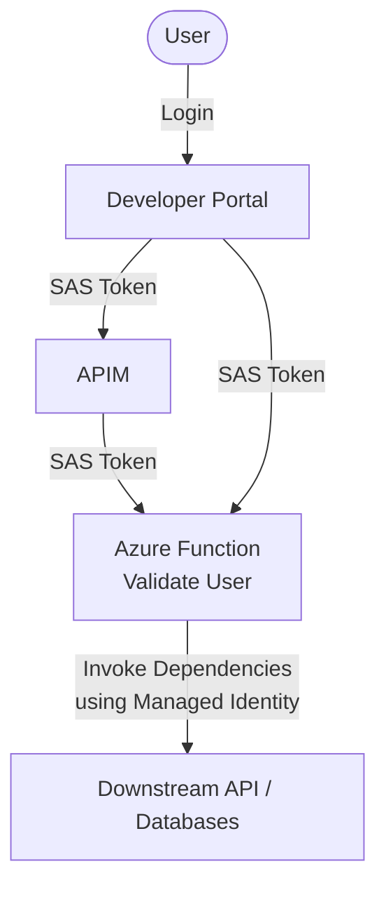

# Custom Widget Sample for Azure API Management

## Overview

This project includes a sample widget for Azure API Management Developer Portal. The widget is a simple HTML form that will create a basic [App Registration](https://learn.microsoft.com/en-us/security/zero-trust/develop/app-registration) with a display name, description, and a SPA platform with redirect uris.  It does this by invoking external API (Azure Function) on click of a button. The widget is configured using the following custom parameters:

- Identity API Url - Azure function url that will perform the identity validation and app registration functions

The *api* folder contains the code for the Azure Function API. The API is a C# Azure function app that accepts the below parameters as headers:

- authorization: The user SAS token that is passed to the the widget
- x-ms-user-id: The user id that is passed to the widget
- x-apim-management-url: The URL of the APIM Management endpoint
- x-apim-api-version: The version of the APIM Management API

These parameters are obtained by calling the [askForSecrets](https://learn.microsoft.com/en-us/azure/api-management/developer-portal-extend-custom-functionality#azureapi-management-custom-widgets-toolsaskforsecrets) function in the widget.

The function validates the user token and user id using the Authentication service but looking up the user in APIM and validating it is valid. Then the function uses its managed identity to make calls to the downstream apis to create and list the app registrations.  In order for the managed identity to have the necessary permissions, it needs to either be assigned an appropriate role or create a new app registration with the necessary permissions that the function app can use. If you choose the latter, you will need to update the DefaultCredential logic to specify that you want to use the new app registration.

### Architecture Diagram

## Deploying the API

- Change the directory to *api*
- To create and deploy the [function app](https://learn.microsoft.com/en-us/azure/azure-functions/create-first-function-cli-csharp?tabs=azure-cli#create-supporting-azure-resources-for-your-function)
  - Or you could check out my [quick-deploy.sh](./api/iac/quick-deploy.sh) script in the iac folder.
- More information on the Azure Function can be found [here](./api/README.md)
> Note: The function app managed identity should have the necessary permissions to create and list app registrations in the tenant.

## Deploying the widget

- Update the subscription, resource group and apim instance name in the resoureceId field of deploy.js
- Execute *npm run deploy*
- The widget is deployed to the APIM instance
- Add the widget to a page in the developer portal
- Configure the widget with the Identity API Url
- You will need to publish the portal after you've configured the widget and added it to a page
- More information on the custom widget can be found [here](./src/README.md)